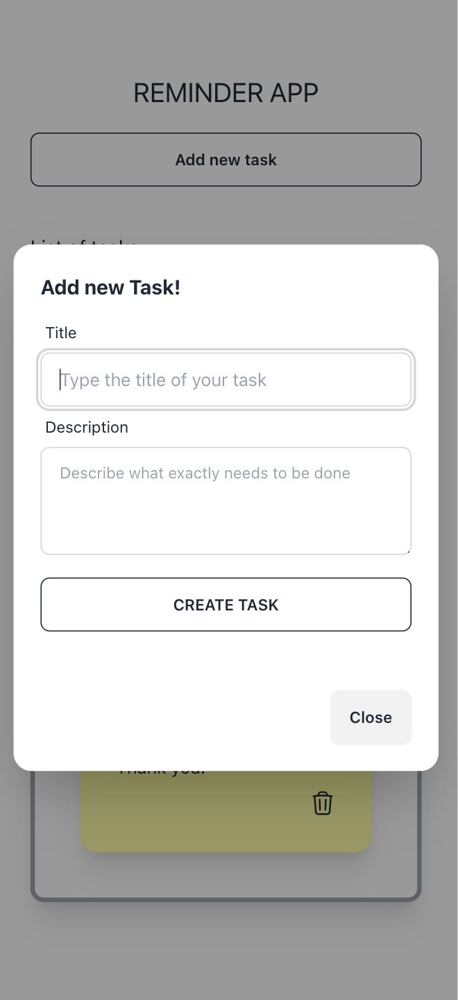

## Introduction

This is a Vite + React project that implements the Frontend part of a Reminder Tasks application.

You can basically create new Todo Tasks, display them on a dashboard and remove them.

I have used TailwindCSS to make the UI more elegant and responsive.

This app needs a working API for the Backend part, which is implemented in a separate .NET API project which can be found at [.NET Backend API](https://github.com/dantgn/reminder-tasks-api-dotnet)

See screenshots of the application below:

### Desktop version

### Mobile version

