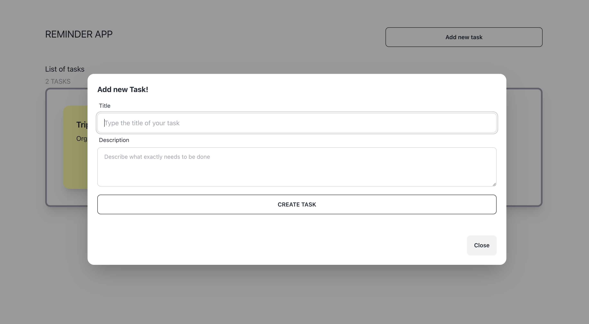

## Introduction

This is a Vite + React project that implements the Frontend part of a Reminder Tasks application.

You can basically create new Todo Tasks, display them on a dashboard and remove them.

I have used TailwindCSS to make the UI more elegant and responsive.

This app needs a working API for the Backend part.
You can find two options as Backend: 
- The first one is implemented using a Python FastAPI project which can be found at [Python Backend API](https://github.com/dantgn/reminder-app-python) 
- The second one is implemented using a .NET API project which can be found at [.NET Backend API](https://github.com/dantgn/reminder-tasks-api-dotnet)

I have deployed the Frontend Project and the Python project on Vercel, and it can be tested at https://reminder-tasks-frontend.vercel.app

See screenshots of the application below:

### Desktop version

### Mobile version

